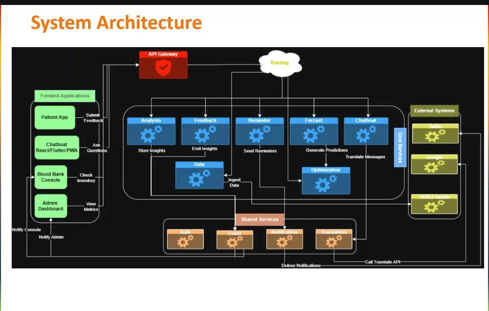
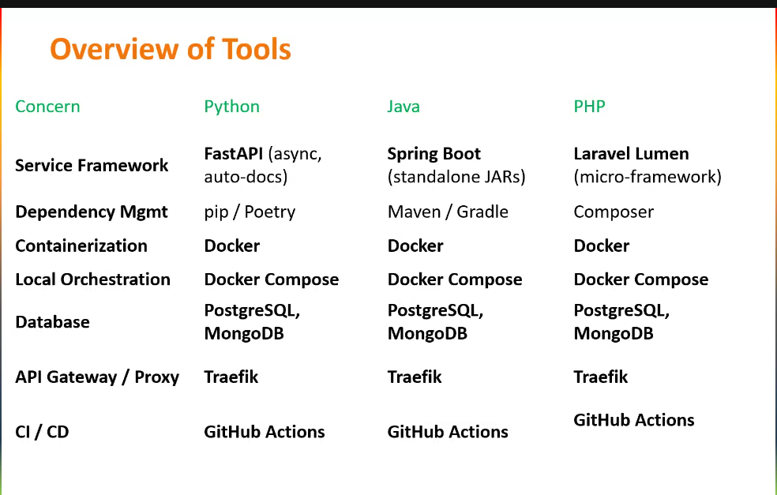

# CODE2CARE_AICELLGI
# 🩺 Hackathon IA en Santé 2025 : Solutions pour l’Hôpital Général de Douala

> **Solutions IA pour transformer les soins de santé à l’Hôpital Général de Douala**

Ce dépôt contient les prototypes et la documentation technique développés par l’équipe **AICELLGI** lors du Hackathon IA en Santé 2025, organisé à l’Hôpital Général de Douala (DGH) en partenariat avec Data Science Without Borders (DSWB) et financé par la Wellcome Trust. Les solutions proposées répondent à trois défis clés : un système de gestion des retours et rappels des patients, un chatbot éducatif basé sur des modèles de langage (LLM), et un système de surveillance des stocks de banque de sang.

## Structure du dépôt
Le dépôt est organisé en plusieurs dossiers pour faciliter l’accès aux ressources :

| **Dossier**       | **Contenu**                                                                 |
|--------------------|-----------------------------------------------------------------------------|
| `Track1/`         | Fichiers pour le Système de gestion des retours et rappels des patients.    |
| `Track2/`         | Fichiers pour le Chatbot pour l’éducation et le soutien des patients.        |
| `Track3/`         | Fichiers pour le Système de surveillance et de prévision des stocks de sang. |
| `documentation/`  | Rapports techniques, manuels, et diapositives de présentation.              |
| `data/`           | Données synthétiques ou approuvées utilisées pour les tests.                |

Chaque module contient un fichier README détaillant les instructions pour configurer, exécuter, et tester les prototypes, incluant les dépendances logicielles et les prérequis techniques.

## 🚀 Fonctionnalités

### **Track 1 : Système de gestion des retours et rappels des patients**
- **Analyse des retours** : Collecte et analyse des sentiments/thèmes via NLP (anglais, français, Douala, Bassa, Ewondo).
- **Rappels multilingues** : Envoi de notifications pour rendez-vous et médicaments, adaptées aux environnements à faible bande passante.
- **Interfaces inclusives** : Support des entrées visuelles (emojis, étoiles) et vocales/textuelles.
- **Accessibilité** : Optimisé pour les réseaux à faible connectivité.

### **Track 2 : Chatbot pour l’éducation et le soutien des patients**
- **Conversation intelligente** : Réponses claires et empathiques sur diagnostics, médicaments, et soins via LLMs (Mistral, LLaMA).
- **Adaptation culturelle** : Interface multilingue et sensible aux contextes locaux.
- **Accessibilité utilisateur** : Interface simple (Streamlit) pour les patients à faible littératie numérique.

### **Track 3 : Système de surveillance et de prévision des stocks de banque de sang**
- **Surveillance en temps réel** : Suivi des niveaux de stock de sang.
- **Prévision de la demande** : Modèles de séries temporelles (ARIMA, XGBoost) pour anticiper les besoins.
- **Visualisation interactive** : Tableaux de bord (Plotly) pour une gestion optimisée.
- **Recommandations** : Suggestions pour l’optimisation des commandes.

### **Fonctionnalités transversales**
- **Tableau de bord web** : Interface React pour visualiser les données et gérer les alertes.
- **API RESTful** : Intégration avec les systèmes hospitaliers existants.
- **Conformité éthique** : Respect des normes de confidentialité et de protection des données.

## 🏗️ Architecture

 
 
## 🛠️ Pile Technologique

### **Backend**
- **Python 3.8+** : Logique principale des applications.
- **TensorFlow 2.x** : Framework pour les modèles d’apprentissage automatique.
- **FastAPI** : Framework pour l’API RESTful.
- **PostgreSQL** : Gestion des données hospitalières.
- **Redis** : Cache pour les performances à faible latence.
- **Celery** : Traitement asynchrone des tâches.

### **Frontend**
- **React 18.x** : Interface utilisateur interactive.
- **Material-UI** : Composants pour une interface moderne.
- **Chart.js** : Visualisation des données (tableaux de bord).
- **Axios** : Requêtes HTTP vers l’API.

### **DevOps et Infrastructure**
- **Docker** : Conteneurisation des services.
- **Kubernetes** : Orchestration pour le déploiement.
- **Google Cloud/AWS** : Hébergement cloud.
- **GitHub Actions** : Pipeline CI/CD.
 

## 📊 Modèles d’Apprentissage Automatique

### **Track 1 : Gestion des retours et rappels**
- **Analyse des sentiments** : Modèles NLP (spaCy) pour identifier les thèmes.
- **Reconnaissance vocale** : Google Cloud Speech-to-Text pour les interactions vocales.
- **Multilinguisme** : Support des langues locales via Hugging Face.

### **Track 2 : Chatbot éducatif**
- **Modèles LLM** : Mistral/LLaMA via Hugging Face pour des réponses conversationnelles.
- **Personnalisation** : Fine-tuning pour un langage empathique et adapté.

### **Track 3 : Prévision des stocks**
- **Prévision** : ARIMA et XGBoost pour les séries temporelles.
- **Visualisation** : Plotly pour les tableaux de bord interactifs.
- **Optimisation** : Algorithmes pour recommandations de gestion des stocks.

## 🤝 Contribution

1. Forker le dépôt.
2. Créer une branche (`git checkout -b feature/nouvelle-fonctionnalite`).
3. Valider les modifications (`git commit -m 'Ajout d’une fonctionnalité'`).
4. Pousser sur la branche (`git push origin feature/nouvelle-fonctionnalite`).
5. Ouvrir une Pull Request.

## 📜 Licence

Ce projet est sous licence MIT - voir le fichier [LICENSE](LICENSE) pour plus de détails.

## 👨‍💻 Équipe AICELLGI

- **AZANGUE LEONEL DELMAT (Chef)**  
  - GitHub : [@Delmat237](https://github.com/Delmat237)  
  - LinkedIn : [leonel-azangue](https://www.linkedin.com/in/leonel-azangue)  
  - Email : azangueleonel9@gmail.com  

- **BALA ANDEGUE FRANCOIS LIONNEL**  
  - GitHub : [@BalaAndegue](https://github.com/BalaAndegue)    
  - LinkedIn : [francois-lionnel-bala-andegue](https://www.linkedin.com/in/fran%C3%A7ois-lionnel-bala-andegue-0118612b2) 
  - Email : balaandeguefrancoislionnel@gmail.com  

- **NGONGA TSAFANG JACQUY JUNIOR**  
  - GitHub : [@jacks524](https://github.com/jacks524) 
  - LinkedIn : ...
  - Email : junsts719@gmail.com

- **TCHOUTZINE TCHETNKOU BALBINO CABREL**  
  - GitHub : [@zoom-BT](https://github.com/zoom-BT)) 
  - LinkedIn : [@BalbinoTchoutzine](https://www.linkedin.com/in/ balbino-tchoutzine)
  - Email :  tchoutzine@gmail.com  

## 🙏 Remerciements

- **Wellcome Trust** : Pour le financement et le soutien.
- **DGH et DSWB** : Pour l’organisation et l’accueil.
- **Communautés open source** : TensorFlow, Hugging Face, React.
- **Participants** : Pour leur engagement dans l’innovation en santé numérique.

---

⭐ **Ajoutez une étoile à ce dépôt si vous le trouvez utile !**
